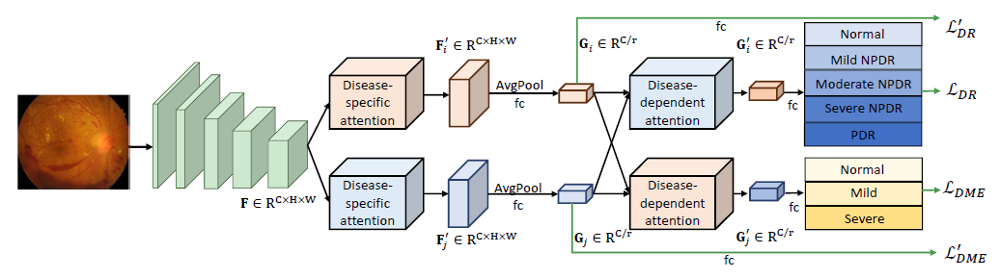

## CANet: Cross-disease Attention Network for Joint Diabetic Retinopathy and Diabetic Macular Edema Grading

Pytorch implementation of CANet: Cross-disease attention network. <br/>

## Paper
[CANet: Cross-disease Attention Network for Joint Diabetic Retinopathy and Diabetic Macular Edema Grading](https://arxiv.org/abs/1911.01376)
<br/>
IEEE Transactions on Medical Imaging, 2019
<br/>
<br/>
<p align="center">
  
</p>

## Installation
* Install Pytorch 1.1.0 and CUDA 9.0
* Clone this repo
```
git clone https://github.com/xmengli999/CANet
cd CANet
```

## Data Preparation
* Download [Messidor dataset](http://www.adcis.net/en/third-party/messidor/) <br/>
* Put the data under `./data/`


## Train
* Download [ImageNet pretrain model](https://download.pytorch.org/models/resnet50-19c8e357.pth) and put it under `./pretrain/`
or Download the [kaggle DR pretrain model](https://drive.google.com/file/d/1RPnX9G38qQfBI84_nuNWmYpJG5Q2XNvG/view) and put it under `./pretrain/`
* cd `messidor_scripts` and specify the pretrain model in `train_fold.sh`
* Run `sh train_fold.sh` to start the training process

## Evaluate
* Specify the model path in `eval_fold.sh`
* Run `sh eval_fold.sh` to start the evaluation.


## Citation
If you find the code useful for your research, please cite our paper.
```
@article{li2019canet,
  title={CANet: Cross-Disease Attention Network for Joint Diabetic Retinopathy and Diabetic Macular Edema Grading},
  author={Li, Xiaomeng and Hu, Xiaowei and Yu, Lequan and Zhu, Lei and Fu, Chi-Wing and Heng, Pheng-Ann},
  journal={IEEE transactions on medical imaging},
  volume={39},
  number={5},
  pages={1483--1493},
  year={2019},
  publisher={IEEE}
}
```

## Acknowledgement
CBAM module is reused from the [Pytorch implementation of CBAM](https://github.com/Jongchan/attention-module).

## Note
* Contact: Xiaomeng Li (xmengli999@gmail.com)
